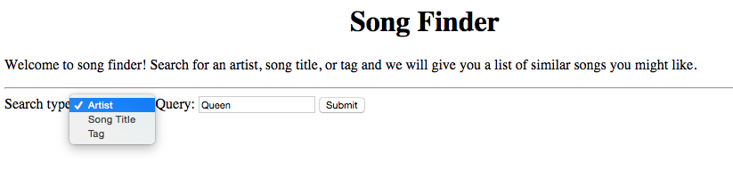
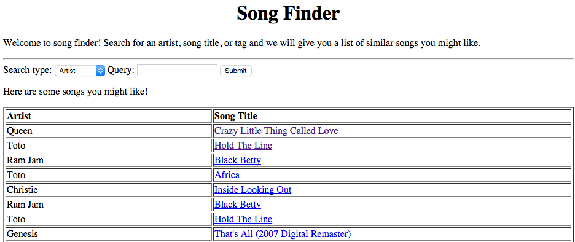

Project: Release 2 - Web-Based Music Search
==============================================

### Suggested Deadline Monday 11/27/2017

There is no specific deadline for release 2 of this project. When you are passing all test cases and believe you are ready for a code review you must *create a new release* on github. You will then undergo code review and will be asked to revise and resubmit your work until mastery is demonstrated. 

:warning: If you do not make early progress on this assignment you will not be able to complete the following requirements in order to pass this class:

1. You must demonstrate mastery of release 1 before moving on to release 2.
2. You must demonstrate mastery of releases 1 and 2 *and* complete all functionality requirements of release 3 in order to pass this course.
3. You may resubmit solutions *at most* once per week. 
4. You must have an in-person code review, which must be scheduled with the instructor.

For this project, you will extend your previous project in two ways: first, you will implement *thread-safe* search functionality in your music library (:warning: Don't forget what you learned about thread safety in Release 1!) and second, you will implement a basic web interface for your service.

# Part 1 - Search

You will first extend your music library to allow a user to search by artist, title, and tag.

**Search By Artist** - Given an artist, return all songs that are similar to *any* song by that artist. The recommended algorithm for implementing this functionality is as follows:

```
initialize resultList 
songs = list of songs by given artist
for each song in songs
	similarList = list of songs similar to song
	for each similarSong in similarList
		add similarSong to resultList

```

As an example, suppose the artist is Toto and the library contains the information indicated below:

```
Songs by Toto: [Africa, Rosanna]
Songs similar to Africa: [Kyrie, Broken Wings]
Songs similar to Rosanna: []

```
The result would return Kyrie and Broken Wings. If there were songs similar to Rosanna, those would be returned as well.

**Search By Title** - Given a song title, return all songs that are similar to *any* song with that title. *Note that there may be two songs with the same title.* The algorithm you should use to implement this functionality is nearly identical to the algorithm used to search by artist. You will likely, however, need to extend your data structure to maintain a set of all songs indexed by title. 

**Search By Tag** - This functionality is slightly different than search by artist or search by title. In this case, simply return the songs that have the given tag. This should be fairly easy to implement, but will also likely require you to add another data structure to your music library that maintains a set of songs indexed by tag.

### Hints

- It is recommended that you implement three `searchBy` methods in your `MusicLibrary`. 
- Make sure your methods are thread safe.
 - :warning: Do not return references to any mutable objects or data structures!
- Consider returning a set of `JSONObject` from each search method. As you identify a `Song` that should be returned, convert the `Song` object to a JSON representation of the object using the schema below:

```json
{
	"artist":"DJ Quik",
	"trackId":"TRAAMJY128F92F5919",
	"title":"Born and Raised In Compton"
}
```

## Configuration ##

To test your search functionality, you will extend your `Driver` arguments and described below. Note that this is really just for testing purposes (and is required to qualify for code review!), however if you implement the functionality as recommended above it will be easy to integrate your `MusicLibrary` into your web application.

**Arguments - searchInput** - The value following the optional `-searchInput` flag will be the path to a json file containing several search queries. 

An example file would look as follows:

```json
{
	"searchByArtist": ["Queen", "Busta Rhymes"],
	"searchByTitle": ["Wishlist", "Ode To Billie Joe  (Live @ Fillmore West)"],
	"searchByTag": ["50s rockabilly"]
}
```

Each key (searchByArtist, searchByTitle, and searchByTag) is optional. If present, the key will map to an array of strings, where each string is a query.

**Arguments - searchOutput** - The value following the optional `-searchOutput` flag will be the name of a specific file where your program will store the output of executing the queries specified by the `searchInput` file.

 The format of the `searchOutput` file will be as follows:
 
```json

 {
   "searchByArtist":[
      {
         "artist":"Queen",
         "similars":[

         ]
      },
      {
         "artist":"Busta Rhymes",
         "similars":[
            {
               "artist":"DJ Quik",
               "trackId":"TRAAMJY128F92F5919",
               "title":"Born and Raised In Compton"
            },
            {
               "artist":"Sticky Fingaz",
               "trackId":"TRAAZBD128F427A97D",
               "title":"Oh My God"
            }
         ]
      }     
   ],
   "searchByTag":[
      {
         "similars":[
            {
               "artist":"Johnny Horton",
               "trackId":"TRAPMCS128F92E88C5",
               "title":"The Woman I Need (Honky Tonk Mind)"
            }
         ],
         "tag":"50s rockabilly"
      }
   ],
   "searchByTitle":[
      {
         "similars":[
            {
               "artist":"Nirvana",
               "trackId":"TRADPIA128E078EE1B",
               "title":"Heart-Shaped Box"
            },
            {
               "artist":"Guns N' Roses",
               "trackId":"TRBICGT128E0792473",
               "title":"Patience"
            }
         ],
         "title":"Wishlist"
      },
      {
         "similars":[

         ],
         "title":"Ode To Billie Joe  (Live @ Fillmore West)"
      }
   ]
}

```


The `searchByArtist` key maps to an array. That array contains a JSONObject for each artist query specified in the input file. Each JSONObject has the search query (e.g., `"artist": "Queen"`) as well as a list of JSONObjects returned as results from the `MusicLibrary`. Each result contains only three pieces of information about the song---the artist, track id, and title.

An example run of your program would look as follows:

```
java Driver -input input/lastfm_subset
			  -output results/songsByArtistSubset.txt 
			  -order artist 
			  -threads 5
			  -searchInput input/queries.json
			  -searchOutput results/searchResults.json
```			

For Part 1, you must pass all of the `Project2Test` unit tests.

# Part 2 - Web Interface

For part 2, you must implement a web application to provide access to your `MusicLibrary` *and* deploy  you application on the CS microcloud servers. A guide for getting started with the microcloud is here: [microcloud guide](https://github.com/srollins/software-dev-materials/blob/master/notes/usf_guides/microcloud.md)

## Functionality ##

- You must deploy your server to your assigned [microcloud node](https://github.com/CS514-F17/notes/blob/master/Admin/mcassignments.md) at your assigned port.
- Your server will accept requests for `host:port/search`.
- The `/search` page will allow the following:
 1. Select search type from the options artist, title, or tag.
 2. Enter query.
- Once the user submits the query, the server will display a list of all similar songs, as defined by the `searchBy` functionality in Part 1 of this assignment. 

The images below illustrate a possible interface for this functionality:





## Hints ##

- Consider implementing two `Servlets`: a `SearchServlet` and a `SongsServlet`.
- Implement the `contextInitialized` method as discussed in class. In the method, build your thread-safe `MusicLibrary` and set it as an attribute in the context.
- The `SearchServlet` will simply return the search page. 
- `Submit` will issue a request to the `SongsServlet`. The `SongsServlet` will execute a search on the `MusicLibrary` and will return an HTML page containing the response.
- Note that in my solution I provide the search box at the top of every page.


## Submission ##
Once you create a release we will do a deployment check to verify that your fully functional solution is running on the microcloud.

You must pass all of the `Project2Test` tests and the deployment check in order to qualify for code review.

Follow these instructions *carefully* in order to submit your project: [Project Submission Procedure](https://github.com/CS514-F17/notes/blob/master/Admin/projectsubmission.md)

### Submission Requirements

1. Use the `SongFinder` project you created for Lab 3 for this assignment. You do not need to create a new Eclipse project.
2. For full credit, make sure to follow all [Style Guidelines](https://github.com/CS514-F17/notes/blob/master/Admin/style.md). Points will be deducted for each violation.


### Grading Rubric

You may not move on to release 3 of this project until you have demonstrated mastery. 

:warning: As noted in the [Project Submission Procedure](https://github.com/CS514-F17/notes/blob/master/Admin/projectsubmission.md), you *may* receive deductions for failing to follow instructions or fix issues before resubmission.

In order to pass this class you **must** demonstrate mastery for Release 1 and Release 2 and you must pass all of the functionality tests for Release 3.


### Academic Dishonesty

Any work you submit is expected to be your own original work. If you use any web resources in developing your code you are strongly advised to cite those resources. The only exception to this rule is code that is posted on the class website. The URL of the resource you used in a comment in your code is fine. If I google even a single line of uncited code and find it on the internet you may get a 0 on the assignment or an F in the class. You may also get a 0 on the assignment or an F in the class if your solution is at all similar to that of any other student.
